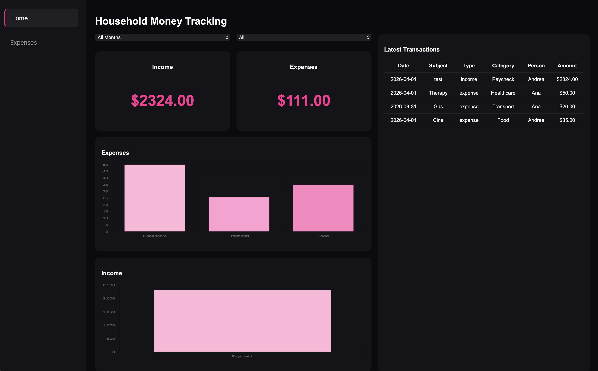
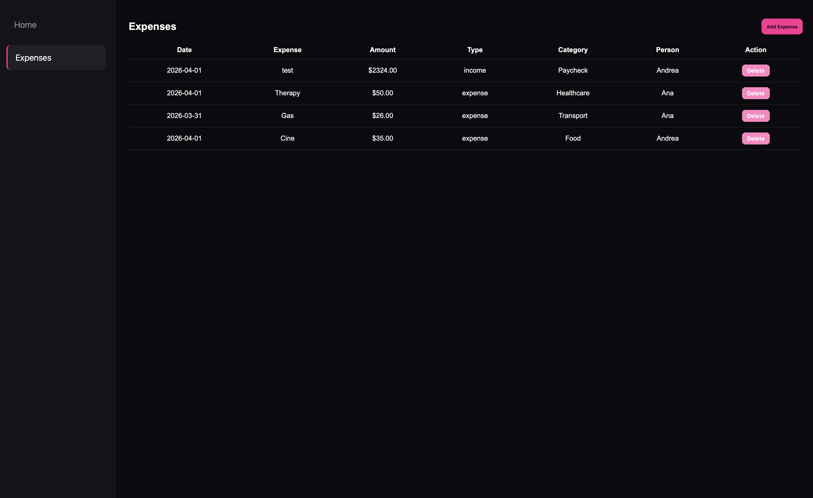
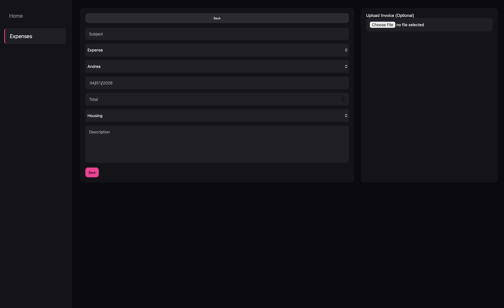

I made this expense tracker for me and my partner, but feel free to use the code as a reference for you and whoever you want as well (or solo whoops)

- Made the base code on VSCode
- Frontend on Supabase
- Deployed using Vercel

Check it out >>>

Home View

Expenses View

Add Expenses View

Note: As of April 1st 2026 this project is still a work in process. The website works (+ all the stuff in it) but I'm working on some improvements for the website.
